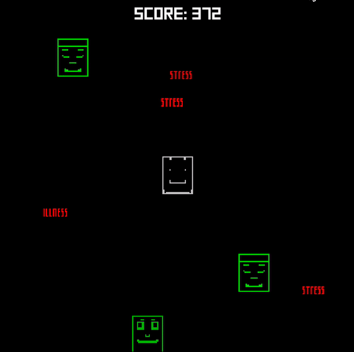

# Lifeless - A little depressing game
*[A Ludum Dare 44 game](https://ldjam.com/events/ludum-dare/44/lifeless-a-very-depressing-game)*

Hi, this game was made using Amethyst with Rust. This was my first time using this engine and really my first time building anything substantial with Rust. The game revolves around giving and taking health as life’s unfortunately events come flying at you. Your score is based on how many family members are alive. Health is displayed as a color. Your final score gets printed out on the terminal.



## Controls

* **Key T** - Take Life -- Move your character over one of your family members and hold the key

* **Key G** - Give Life -- Same as above but with G key

* **Arrow Keys** to move around

* **Key ESC** -- exit game

## Installation
*Note: This was compiled on Mac OS High Sierra 10.13.3 with a 3.2 GHz Intel Core i5*

To compile from source code is kind of a pain because it takes so dang long.

1. First acquire rust
2. Then amethyst tools
3. Then you can run

Below assumes you have brew installed.

```bash
brew install rust
cargo install amethyst_tools
git clone https://github.com/tfdiaz/lifeless
cd lifeless
cargo run
```
Also you can go to the release tab above and download the binary with assets. This file will need to be decompressed and then you need to run the executable from that file.

## Technical Notes

There is currently one way to win this game and that is to crash into all the life events as soon as you can (the red words). This is because if there are no life events, the game will not be able to spawn new ones. This is a bug, but in a philosophical sense, a feature.

If I had more time, I would have loved to add some music and more messages at the bottom. This game was the result of 48 hours for Ludum Dare 44.

I am hoping to post a blog entry for my thoughts and tips using the engine sometime soon. Be on the look at Tomaswrite.com

Thank you for taking the time to play my little sad game. It was a painful but very much a satisfying experience.
